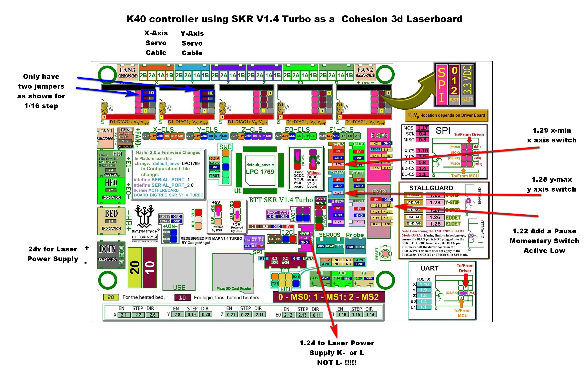

This config file with the smoothieware firmware will make a BigTree SKR V1.4 Turbo work similar to a Cohesion3d Laserboard. Use the firmware.bin included in this directory and the attached config.txt file. 

# SKR v1.4 Turbo Setup
* Set drivers to 1/16 steps using the jumpers as seen in the image.
* Need to adjust TMC2208 a similar to 1.2amp which measures 1.2v as seen in the below image.   
   
* NEOpixel pin 1.24 is PWM to L or K- on the power supply. L is not the same as the L- which is the negative from the laser tube! Nor is it the same as AC L as in Live.  
* Drivers for x-axis and y-axis. Cables from K40 plug right in.
* x-axis and y-axis switch need to be moved to a 3pin JST connector. 
* Expansion Pin 1.22 is for a new switch to Pause the program. Attach the other side of the tactile switch to ground.
* Panel, as in using an LCD, is disabled but feel free to update config file.
* Z-Axis is untested   
* TFT UART works for some debugging and basic commands if you wish. 
* Hookup to LightBurn. Select Smoothiewear with all the defaults. Once done, Edit->Device Settings->Enable Smoothie Clustering.   
   

# Power Supply Hookup
* L-   From Laser Tube return. Generally hooked up to a milli-amp meter
* FG   Frame Ground. Not digital Ground. Tie this straight from the wall IEC Connector.
* N    Neutral. Black on my K40
* L    Line. Red on my K40. From the emergency stop switch.
---
* G Ground
* PG Power Good. Use this as a loop to your lid interlock, and your flow switch.
---   
* K+ Positive True Fire Laser
* K- Negative True Fire Laser. Can be hooked to test switch or the SKR    
---
To Potentiometer. 10K works
* G  -  Ground to right tap
* IN - To center tap
* 5v - To Left tap
---
* 24v - To SKR board and accessories
* G - Ground
* 5V - To accessories
* L - Same as K-. I hooked mine up to the Neopixel pin, 1.24